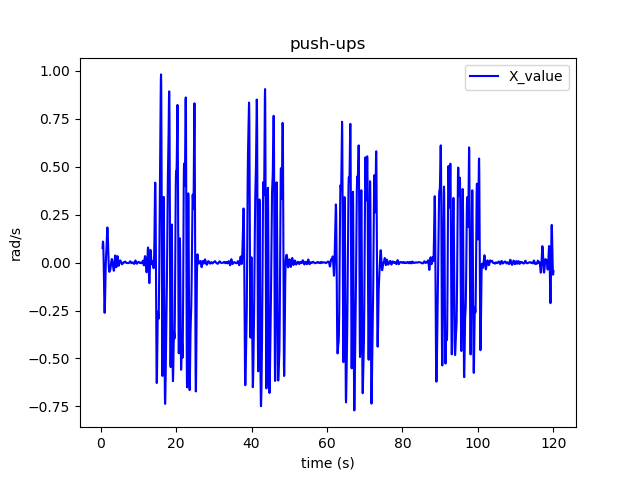
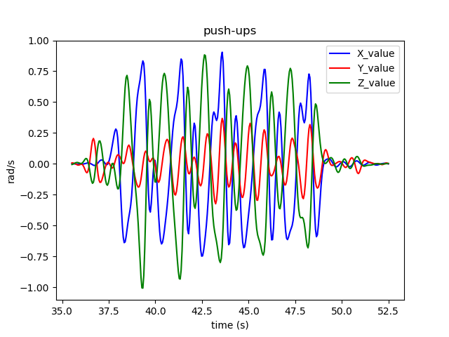
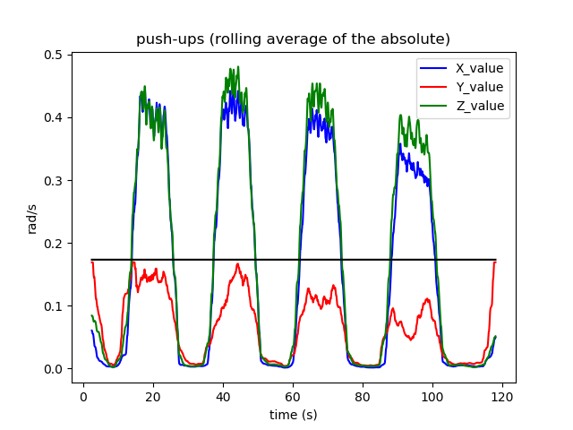
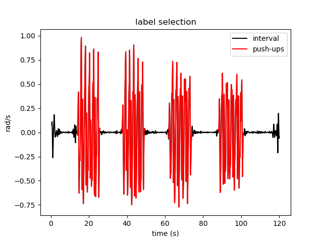
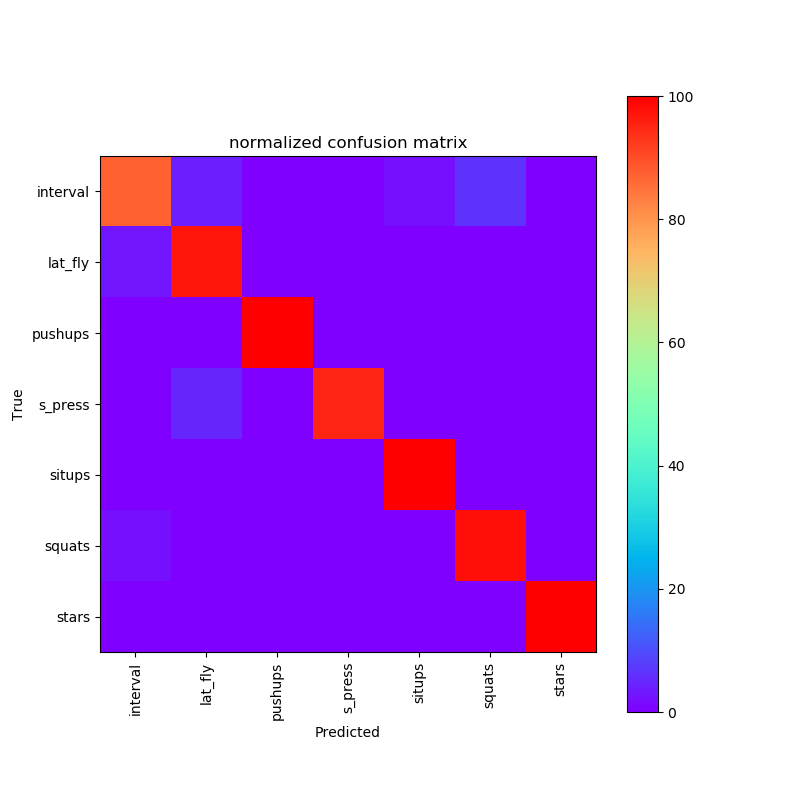
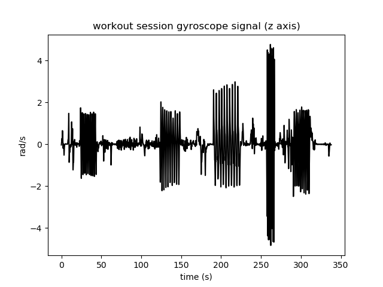
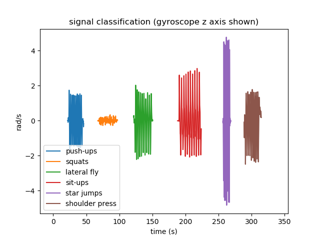
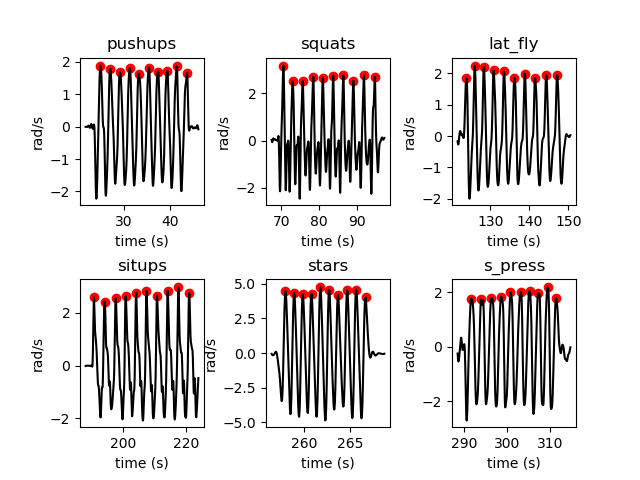

# Activity Classification
Using accelerometer/gyroscope signals collected via a smartphone, activities (push-ups, sit-ups etc.) are detected using deep learning (LSTM RNN) and repetitions of each activity counted. 
This allows for exercises completed during a workout session to be automatically logged without any user input.
# Data Collection
3 axis (xyz) linear acceleration and gyroscope signals were collected from a smartphone (Sensor Kinetics Pro app) strapped to the upper left arm.
Signals were sampled at 200Hz for the linear accelerometer and 400Hz for the gyroscope. 
To collect training data, an activity was repeated (5-20 repetitions), followed by a rest (interval), and then repeated, e.g. 10 push-ups - 30s interval - 10 push-ups - 30s interval - 10 push-ups. 
Data were collected for 6 different activities; Push-Ups, Squats, Sit-Ups, Star Jumps, Dumbbell Shoulder Press, and Dumbbell Lateral Fly.
Each recording was labelled with the corresponding activity.
In total, ~250 repetitions were completed for each activity.
# Signal Processing
All signals were filtered using a low-pass filter with a cut-off of 2Hz to remove any high frequency noise and because movement related to the activity of interest was likely to be lower than 2Hz.
After filtering, the signals were down sampled to 20Hz so that the sample rate of the gyroscope and linear accelerometer were matched and also to reduce the signal length to speed up processing.
The rolling mean (window size of 1s) was also removed to reduce the effect of any drift in the signal.
An example of a processed push-up gyroscope recording is shown (4 sets of 5 reps).

Full signal recorded (x-axis only)

Segment of the above signal (xyz axis)

# Labelling Training Data
Firstly, the periods of each recording where the activity was being complete needed to be separated from the interval periods and labelled accordingly.
This could have been achieved by hand but this would have been tedious. 
Instead, an automated method of selecting activity periods was invented.
An assumption was made that periods in which the activity was completed would have greater movement over a prolonged period compared to rest periods between exercises (a limitation of this method would be in the person made large movments during the rest periods).
Therefore, the periods of large movements were selected to be the activity, and because each recording only included one activity type (labelled at time of recording), these periods of movement were labelled as that activity.
To do this, the absolute of the signals was taken and the a rolling average performed (4s window) as shown in the figure below.
The axis with the largest mean was chosen to be used to segment the recording (Z axis in the example below).
The periods in which the chosen axis was above it's mean (black line) were selected and the corresponding periods of the processed signal (red selection in 2nd figure) were labelled the activity, whilst the other parts of the signal labelled as "interval" periods (i.e. non exercise).
After segmenting the signals, the amplitudes were normalised within each sensor (accelerometer and gyro). 
This was done so that the model would not rely upon difference in amplitudes, as these are likely to different between people.
Time periods were Z axis signal is above mean were selected as periods of push-ups.

Periods of signal labelled as activity or interval (only X axis shown).

# Preparing Data For Modelling
The first aim of this project was to classify the signals as being one of 6 activities or an interval between exercise.
To achieve this a Long Term Short Memory Recurrent Neural Network or LSTM was used to build a classification model (https://colah.github.io/posts/2015-08-Understanding-LSTMs/).
LSTMs have the ability to utilise important information about the sequence of the input data (i.e. the signal goes up before going down) which is obviously important in understanding humen movement, especially repetititve movement like exercise.
The benefit of LSTMs is that these models allow for multiple time series to be used as inputs (i.e. xyz).
A Feedforward Neural Network could have been used by extracting features from the signal (e.g. ratio between x and y axis or peak frequency etc.) and using these as inputs.
Such a model may work just as well, but the advantage of the LSTMs is that there is no need for this feature extraction that may rely on domain knowledge of the signals you are working with, instead you can just input the raw signals.

The LSTM takes input data as 3 dimensions. The 1st dimension (i.e. rows) are the number of samples, the 2nd dimension (i.e. columns) are the time points, and the 3rd dimension is the different features (e.g. x axis, y axis etc.). 
Here, the interval and activity periods were cut into 4s long samples (if what remained of the period  was > 3.8s the remaining 0.2s were padded with zeros to make an extra sample).
There were 6 features in total, XYZ linear accelerometer and XYZ gyroscope.
Therefore the size of the LSTM input was [2053 (n_samples), 80 (4s * 20Hz), 6 features].
The total samples for each activity/target were; 1254 interval, 144 lateral fly, 109 push-ups, 121 shoulder press, 118 sit-ups, 161 squats, 146 star jumps.
As the number of interval samples was much greater than the other activities (this was to be expected as every recording has intervals while only 1 activity), the interval samples were under sampled to match the number of the activity with the highest samples, in this case 161.
This was done to prevent the model being biased towards the interval class and just predicting every sample as an interval. 
Therefore the final n_samples was 960, down from 2053.
The targets for each sample were one-hot encoded.
Finally, the input data was split into train (75%) and test (25%) sets. 

# LSTM Model
The LSTM model was built using Keras Sequential model. It consisted of a LSTM layer of 100 neurons. 
Dropout was set at 0.5 for regularization to prevent overfitting.
A ReLU activation layer was used before the final Softmax activation layer.
Softmax activation was used as this was a multiclass classification problem and we want the output to be a normalise probability for each activity.
The activity with the highest probability was taken as the prediction.
To compare the target probability with the predicted, the categorical cross entropy loss function was used.
To optimize the model parameters, Adaptive Moment Estimation (ADAM) optimizer was used. 
The batch size was set to n_samples/10 = 96.
Epochs was set to 500.

# Model Performance
The overall accuracy of the model was good, 98%.
The confusion matrix plot shows the predictions of each target class as a proportion of the total number of targets in that class.
This shows each exercise has very good accuracy. 
Only the interval activity class is around 90%, with some interval predicted as squats or lateral fly.

# Applying the Model for Activity Detection
The real-world application of the model is to detect different activities during a full workout session.
To test this, the 6 exercises were performed in a single recording.
In the example presented, the session consisted of 10 push-ups followed by 10 squats, 10 lateral fly, 10 sit-ups, 10 star jumps, and 10 shoulder press.
The signals were filtered and down sampled as was done for the training data.
The model was then applied to 4s rolling windows (normalised as in training)and a class prediction produced for each window.
This allowed for the detection of periods which were classified as exercises.

Processed signal before classification

Classified signal

# Counting Repetitions
Now the exercises have been identified within the signals, it is now possible to determine how many repetitions were completed for each activity.
For each activity, the root mean squared (RMS) of each signal (e.g. XYZ) was calculated to find the signal with most movement contained, as this would be used to count the reps.
The signal was flipped (*-1) if the mean signal below 0 was > signal above 0 (i.e. the largest movements were negative).
The peaks were then counted based on the following rules:
1. The peak threshold had to be above the mean (signal > 0).
2. The distance between peaks had to be > the peak signal frequency - 50%. An FFT was used to determine the peak frequency which provides an approximation of the time between each repetition. 
By removing peak frequency * 0.5 allowed for some difference in frequency between reps.
Once the peaks were selected they were simply conted to give the number of reps.
Along with counting reps, it was also possible to calculate the duration of each activity by taken the time between the start and end of the activity period.

The figure shows selected peaks for each exercise.

# Final Results
The final results table shows each activity in order and how many reps were completed (intervals have no reps) and the duration (secs) of each activity.

|activity|reps|duration|
|--------|----|--------|
|interval|0   |22      |
|pushups |10  |20      |
|interval|0   |25      |
|squats  |10  |26      |
|interval|0   |28      |
|lat_fly |10  |25      |
|interval|0   |41      |
|situps  |10  |32      |
|interval|0   |37      |
|stars   |10  |8       |
|interval|0   |24      |
|s_press |10  |22      |

# Limitations
The data collected to train and test the model was collected from only 2 people.
Therefore the model will likely struggle for other people performing the exercises, who may perform them in a different manner (although differences in absolute amplitude between people was controlled for by normalising signal amplitudes). 
This could be overcome by collecting data from a larger and varied pool of people. 

The other obvious limitation is that only 6 exercises are included. 
Because the sensors were attached to the arm, one would imagine it would be difficult to classify activities in which only the legs are moving without any upper body movement (e.g. leg press, cycling).
However, a way around this may be to include a further sensor from the smartphone which gives information about phone orientation.
This additional information may be enough to classify these activities.

